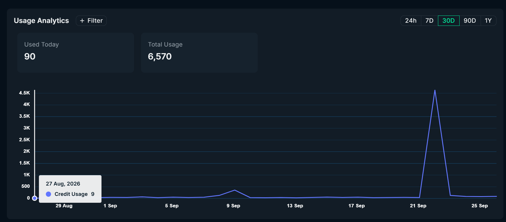

# pulsefeed-ledger

Two tools built on the Nansen API for the Meridian Buildathon: liquidation maps that keep their history, and a ledger that grades trading signals against what actually happened next.

Everything here was tested on a live bot, not a backtest. PulseFeed has been posting calls to a public account, [@aqualanga](https://x.com/aqualanga), for months, and every number below comes from those timestamped posts or from snapshots we took ourselves. You can check them.

The ledger also caught its own author, twice, while this repo was being built. That is in [Corrections](#corrections), near the top, where it belongs.

Demo video (36s): https://x.com/aqualanga/status/2103810041639850437

The first demo, whose claims are corrected below: https://x.com/aqualanga/status/2102688996979560850

## Try it in one minute, no key

```bash
git clone https://github.com/aqualang89/pulsefeed-ledger
cd pulsefeed-ledger
node index.mjs demo
```

Node 20+, no dependencies, no network. `demo` runs the ledger on two synthetic signal sets and replays real BTC liquidation snapshots from `examples/`:

1. **A decoy** shaped like our real data: a score that is pure noise, a risk gate that sets risky coins to 0, and a risk label that actually drives the outcome. The overall rank correlation says 0.41. The ledger then points out that 174 rows sit at exactly 0 and that without them the score ranks nothing (-0.04, 95% CI -0.12 to 0.04).
2. **A planted edge**: +2% of outcome per score point, buried in noise. The ledger finds it (rank correlation 0.40, and the buckets climb in order from -4.6% to +8.1%). A tool that could only ever say "nothing works" would be as useless as one that always says "it works".
3. **Real perp positions**, BTC, one hour on 26 Sep, compared at the same fixed prices at both ends of the window.

The synthetic rows carry `synthetic: true` and are rebuilt by `node examples/make-synthetic.mjs` with a fixed seed.

With a key from [app.nansen.ai/api](https://app.nansen.ai/api) (the free tier is enough):

```bash
cp .env.example .env                   # put NANSEN_API_KEY in it
node index.mjs map BTC                 # one liquidation map, printed
node index.mjs watch BTC,ETH 60        # snapshot every 60s into data/liqmap.jsonl
node index.mjs moved BTC 6             # what the walls did over the last 6 hours
node index.mjs score signals.jsonl     # grade your own recorded signals
node test/liqmap.test.mjs              # the regression test for correction 1
```

## Corrections

### 1. Our "growing walls" were price sliding past old positions (26 Sep 2026)

The first version of `moved` compared "the nearest wall above price" in the first and last snapshot. That wall is a 2% window measured **from the current price**, so when price moves the window moves with it and swallows positions that were always there.

Both examples we published were that artifact:

- 22 Sep, in the demo video and the first README: a wall of BTC shorts "grew from $29.5M to $49.1M in 46 minutes, somebody chose to add". Over those same 46 minutes, the total of all tracked shorts rose by **$4M**, the account count stayed at 97, and inside the window the "wall" jumped between $6.3M and $59.7M from one minute to the next as price wiggled by $30-100.
- 23 Sep: a wall that "nearly tripled in two minutes, all added by anonymous accounts" while price moved $32. Same artifact.

Snapshots now also store `levels`: liquidations summed on a grid of **fixed** prices ($10 steps for BTC). `moved` compares one fixed price range at both ends, and old snapshots without levels are refused instead of compared. `test/liqmap.test.mjs` reproduces the original mistake and checks the fix: price drifts $250 with nobody touching anything, the old reading reports growth, the fixed zone holds at x1.00; a real $20M added inside the zone shows up as exactly $20M.

We found this by grading our own demo the way the ledger grades signals. The same bug was running in our live bot and had already produced a public post ("someone kept adding short exposure"). It is fixed there too.

### 2. "-0.01" was the right conclusion from the wrong statistic (26 Sep 2026)

We published that our 0-10 filter score correlates with the outcome at **-0.01**. That is a Pearson correlation, and outcomes that run from -100% to +2,800% break Pearson: a handful of moonshots and rugs decide it. Measured by rank, the whole sample says **0.41**, which looks like a working score.

It is not. 262 of the 267 signals with a score of exactly 0 were high-risk coins that a hard gate had zeroed. Without those zeros the score ranks nothing: **0.05, 95% CI -0.01 to 0.12, n=840**. The conclusion stands, and it is now shown properly. `score` reports Pearson, rank correlation, both with 95% intervals, and warns when a pile of zeros is carrying the result.

## The tools

### `map` - where the forced exits sit

```
$86,289  97 accounts  longs $1.24B / shorts $1.37B
 +16%   $100,095  short   $42.2M  ####
 +14%    $98,369  short  $168.2M  #################
 +10%    $94,918  short   $61.9M  ######
   0%    $86,289  short   $49.1M  ##### <- price
  -6%    $81,112  long    $91.2M  #########
 -12%    $75,934  long   $345.8M  ##################################
 -20%    $69,031  long   $156.8M  ###############

worst position: short $227.5M at 5X, entry $75,210, liq $136,943, unrealized -$27.9M
```

Longs liquidate below price, shorts above, so the two sides are bucketed separately. The bars are relative to price, which is right for a picture of now and wrong for comparing two moments (see Correction 1). The totals cover the largest accounts Nansen returns, not the whole book, and the tool says so.

#### Named wallets, and why "every wallet is labelled" is a trap

`map` shows how much of each wall sits on wallets with an actual identity, marked `*`:

```
$75.1M of it sits on 6 wallets Nansen has a name for (* in the bars)
 -18%    $70,155  long    $52.4M  **####  named $12.8M

largest named positions:
  zolpi.eth*: long $25.0M at 40X, liq $58,500 (-31.6% from price), unrealized $479K
  samurai.eth: long $12.8M at 18X, liq $70,708 (-17.4% from price), unrealized $1.3M
```

On a live pull of the largest BTC and ETH positions (23 Sep 2026, 187 wallets) all but one carried a Nansen label, so a naive "money on labelled wallets" line reads close to 100% and tells you nothing. Most labels are behaviour categories: `HL Perps Whale` (83, true of anyone in a top-100 list), `Uses <code> HL Referral Code` (70), `High Activity`, `High Balance`, `Token Millionaire`. The tool drops those and keeps ENS names, entities and Smart Money tags: 3% of the BTC book and 5% of the ETH book in that pull.

### `moved` - how the walls changed, at fixed prices

```
BTC: 29 snapshots over 58 minutes, price $83,974 -> $84,131
  all tracked positions: 95 -> 95 accounts, longs -$1.3M, shorts +$11.1M
  wall above, fixed at $83,974-$85,653: $23.1M -> $23.1M  (held, x1.00)
  wall below, fixed at $82,295-$83,974: $34.3M -> $34.4M  (held, x1.00)
  biggest changes at fixed prices:
    $94,051-$95,730 (+12% from start price): $50.2M -> $61.7M  +$11.5M
    $92,371-$94,051 (+10% from start price): $31.2M -> $19.8M  -$11.4M
    $78,936-$80,615 (-6% from start price): $74.2M -> $64.0M  -$10.2M
    $87,333-$89,012 (+4% from start price): $6.1M -> $16.2M  +$10.0M
```

Real capture, 26 Sep 2026, shipped as `examples/liqmap-btc.jsonl` so `demo` replays it. The walls next to price did not move at all. The old version of this tool would have printed two "held" lines and stopped there, and missed the hour's actual story: about $10M of new short exposure parked 4-6% above price, while roughly $11M hopped from the +10% band to the +12% band. That second one is most likely a single position whose liquidation price moved (margin added or size changed), not new money, which is why `moved` prints the change in total longs and shorts next to every zone.

### `score` - the uncomfortable one

Feed it JSONL where each line is a signal you recorded, with the price you saw and a price later:

```json
{"t":1789000000000,"ticker":"ABC","price":1.23,"p1h":1.4,"p24h":0.81,"score":7.5,"verdict":"POST","risk":"high","posted":false}
```

Only `t`, `ticker`, `price` and one later price are required; the report grows as you add fields. `judge` accepts `{ "state": "rug" }` so you can grade a classifier's labels. It reports medians, not averages, because one +2,786% coin turns an average of a thousand rows into nonsense, and it lists what the filter killed that then went up, not only what it saved you from.

## What it found on our own data

1,136 signals our bot recorded over 30 days, each priced at the call and again 1h, 4h and 24h later. Full output in [docs/FINDINGS.md](docs/FINDINGS.md).

- **The score is decoration.** Among coins it actually scored, rank correlation with the outcome is 0.05 (95% CI -0.01 to 0.12, n=840). The top bucket, 8-9, had the worst median of any bucket, -14.1%.
- **A risk label we almost deleted is the signal.** `low`: 47% of calls up, median -0.3%. `high`: 18% up, median -87.4%.
- **A three-state classifier in shadow mode ranked outcomes in exact order:** `rug` median -99.5% (n=40), `overextended` +0.1% (n=123), `normal` +4.0% (n=9, too few to lean on).

## Honest limits

- One bot, one 30-day window, mostly small-cap memecoins. These results are about our filter, not about signals in general.
- The outcome is price 24h later (or the last checkpoint we have). A different horizon could rank things differently.
- Correlation, not causation: the risk label may be proxying for something it does not measure directly.
- The perp data is the ~100 largest Hyperliquid accounts Nansen returns. A change in a fixed zone can also be an account entering or leaving that list, so `moved` shows the change in total tracked longs and shorts next to every wall.
- A liquidation price moves when a trader adds margin or changes size, so money can shift between fixed zones without anyone opening or closing anything.
- `demo` sets 1 and 2 are synthetic by design. They test the instrument, not the market.

## Buildathon eligibility

The rules ask for 1,000+ Nansen API calls between 14 and 27 Sep. Our logs show more than 1,400 on 22 Sep alone (1,000 token-screener calls at 1 credit each, 412 perp-position maps at 5-8 credits), on top of the bot's production traffic since 14 Sep and the snapshots behind this repo. The dashboard shows credits rather than calls, and it lines up: the 22 Sep spike is about 4,600 credits.



## The bot behind it

PulseFeed is a signal bot that uses the Nansen API in production as its smart-money and perps layer. Its prompts and selection thresholds stay closed; what is here stands on its own, together with the measurement method and the real numbers it produced. Correction 1 went back into the bot the same day.

## Nansen endpoints used

| What | Endpoint | Credits |
|---|---|---|
| Open perp positions: entry, liquidation price, unrealized PnL | `POST /tgm/perp-positions` | 5 |
| Credit balance | `GET /account` | free |

`perp-positions` charges per call, not per row, so the map is built from the full 100 positions rather than a cheaper slice.

## License

MIT.
